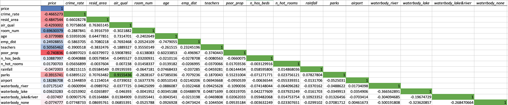
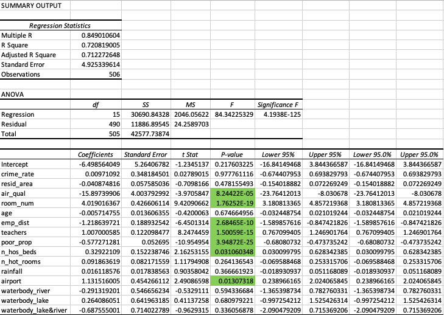

# housing_prices_model
Predicting home prices using a linear regression model

# Overview
## Purpose
I have found data on past property transactions in the hopes of creating a model to forecast future housing prices. 
This analysis is trying to answer two questions:
    1) Given the numerous variables in the dataset, how accurately can I predict the price of a house?
    2) How accurately can we estimate the effect of each variable on the housing price?

## Data Cleaning and Transformation
In this step, I handled outliers, replaced missing values, removed columns and aggregated columns. 

- In the hotel room column there were two outliers, so I changed both values by multiplying the largest non-outlier value by 3 for both rows
- I removed the bus transportation column becuase it had the same values throughout each row of the dataset.
- There were 8 missing values in the hospital bed column, so I replaced the missing values with the average of the rest of the column
- With four columns documenting how far each home was from employment hubs, keeping all 4 was overpresenting the importance of the employment variable. I transformed it from 4 variables to 1 to represent the employment opportunity from that house. I took the average of the four columns to consolidate into 1.

## Preprocess Data
Most of the preprocessing I had to do was to convert qualitative data into quantitative data. The airport column had YES and NO values, so I converted these values to dummy variables within the column. The waterbody columns had four different values, so I split each values into four columns with dummy variables in each. 

## Univariate Analysis
## Correlation Matrix
Correlation is a statistical measure that expresses the extent to which two variables are linearly related. It quantitfies how much they change togther at a constant rate. I wished to know how the independent variables flucuated with the price variable, so I created a correlation matrix below.  
  

I also wanted to determine if there was any mulitcollinearity present, which is when two or more independent variables are highly correlated. I found high multicollinearity between air quality and parks. Since air quality was more highly correlated to price, I decided to delete the parks column.

## Linear Regression Model
In this multiple linear regression model, I am using 15 predictor variables to predict the response variable, price. 

### Hypothesis
Ho: beta(1) = beta(2) ... beta(n) = 0
Ha: At least 1 beta is non-zero

### Metric Interpretation
  
The metrics discussed tell us how well the model fits our data. The y-intercept in the model is insignificant and not realistic as it generated a negative number. Each variable's coefficient represents the rate of change on the price (Y) with a one unit change in the respective X variable. I found air quality correlates the highest to price because it has the highest elasticity. 

The figures to pay attention to are the p-values of the independent variables. The p-values represent the probability that each coefficient contributes a random amount of variabilty to the linear model. Variables with low p-values have a signficiant impact on price and are statistically unlikely to provide random amounts of variance to the model. At the 95% threshold, there were 5 independent variables that were statistcally signficant (highlighted in green). 

Another signficiant figure is the R-squared value. This metric tells us how much the variability around price can be explained. 71.2% of the variability of price can be explained. The closer this number is to 1, the better the model is.

The model generated a p-value less than the signficance value at 95%. This tells us that the model is statistically signficant and that we can reject the null hypothesis that there is no correlation between price and the right hand side variables. 

